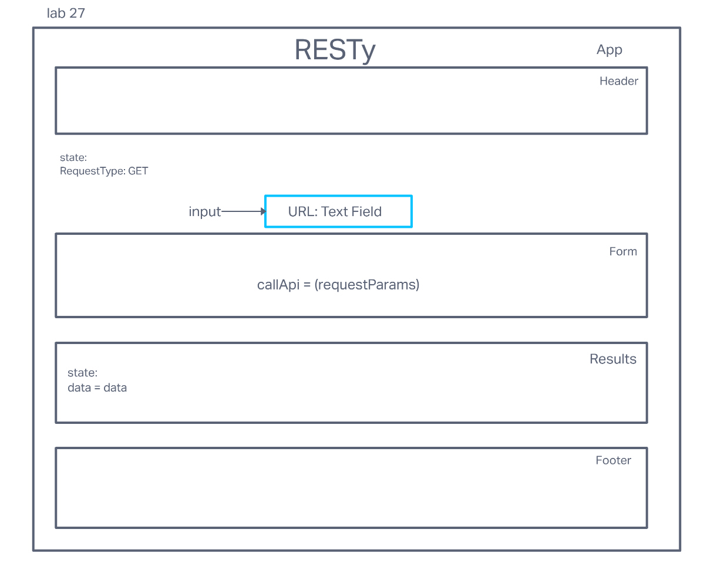

# LAB - Class 27

## Project: useState() Hook
*RESTy Phase 2*

### Author: Steve Gant

### Problem Domain  

In phase 2, we will be receiving user input in preparation of connecting to live APIs, using the `useState()` hook in our functional components. In order to properly manage state with the useState hook, we will now convert `<App />` to a functional component.

### Links and Resources

- [codesandbox](https://codesandbox.io/p/github/stevengant/resty3/lab27?workspaceId=8be27d1e-468c-4d8f-a4af-75875ccb2c76&file=%2Fsrc%2FApp.jsx)
- [GitHub](https://github.com/stevengant/resty3/tree/lab27)

### Setup

#### `.env` requirements (where applicable)

for now I have none and do not require one

#### How to initialize/run your application (where applicable)

- `npm start`

#### How to use your library (where applicable)

#### Features / Routes

- Feature One: Details of feature
- GET : `/hello` - specific route to hit

#### UML

